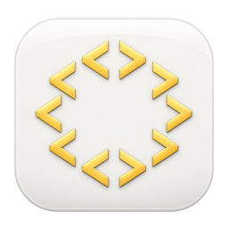

# Drowser 0.1.1

## What’s new

- **Updates in the sidebar.** New versions appear as “Update available”. Read what changed, then download, install and relaunch without replacing the app by hand.
- **Signed updates.** Release information and downloads are verified before installation.
- **Reorder developer tools.** Drag Elements, Console, Network and the other panels into your preferred order. Drowser remembers your layout.

Requires macOS 26 or later. One universal download supports Apple Silicon and Intel Macs.

This is the first Drowser release with an updater. Install this version once; future releases can be installed from inside the app.

## Türkçe

- **Sidebar’dan güncelleme.** Yeni sürüm çıktığında “Update available” görünür. Yenilikleri okuyup güncellemeyi indirin; Drowser kurulumu tamamlayıp yeniden açılır.
- **İmzalı güncellemeler.** Sürüm bilgisi ve indirme dosyaları kurulumdan önce doğrulanır.
- **DevTools sıralaması.** Elements, Console, Network ve diğer panelleri sürükleyerek sıralayın. Seçtiğiniz düzen korunur.

macOS 26 ve üzeri gerekir. Aynı indirme Apple Silicon ve Intel Mac’lerde çalışır.

Bu sürüm güncelleme sistemini ilk kez içerir. Bir kez kurduktan sonra sonraki sürümleri uygulama içinden yükleyebilirsiniz.
